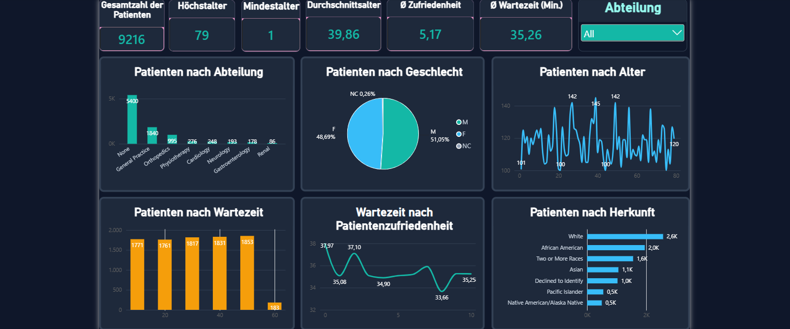
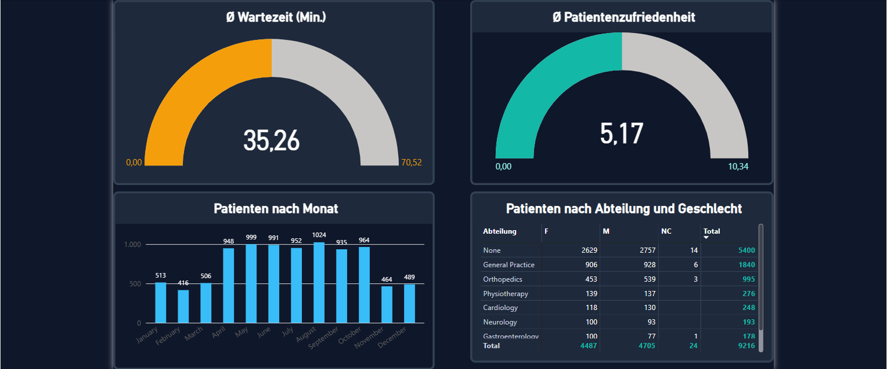

# Healthcare Patient Analytics Dashboard

## Projektübersicht

Dieses Power-BI-Projekt analysiert einen Übungsdatensatz mit Patientendaten aus dem Gesundheitswesen. Ziel des Projekts ist es, wichtige Kennzahlen zu Patienten, Wartezeiten, Patientenzufriedenheit und Abteilungen übersichtlich und interaktiv darzustellen.

## Verwendete Tools

- Power BI Desktop
- Power Query
- DAX
- Datenmodellierung
- Datenvisualisierung

## Dashboard

Das Dashboard besteht aus zwei Seiten:

### 1. Patientenübersicht

Die erste Seite bietet einen Überblick über zentrale Kennzahlen und Merkmale der Patientendaten:

- Gesamtzahl der Patienten
- Höchst- und Mindestalter
- Durchschnittsalter
- Durchschnittliche Patientenzufriedenheit
- Durchschnittliche Wartezeit
- Patienten nach Abteilung
- Patienten nach Geschlecht
- Patienten nach Alter
- Verteilung der Wartezeiten
- Zusammenhang zwischen Wartezeit und Patientenzufriedenheit
- Patienten nach Herkunft

### 2. Abteilungsanalyse

Die zweite Seite konzentriert sich auf zeitliche Entwicklungen und die Verteilung der Patienten nach Abteilungen:

- Durchschnittliche Wartezeit
- Durchschnittliche Patientenzufriedenheit
- Patienten nach Monat
- Patienten nach Abteilung und Geschlecht

## Beispielhafte Erkenntnisse

- Der Datensatz enthält insgesamt 9.216 Patienten.
- Das Durchschnittsalter liegt bei rund 40 Jahren.
- Die durchschnittliche Wartezeit beträgt etwa 35 Minuten.
- Die durchschnittliche Patientenzufriedenheit liegt bei 5,17.
- Die Mehrheit der Patienten wurde keiner spezifischen Abteilung zugeordnet.
- Die monatliche Anzahl der Patienten variiert im betrachteten Zeitraum.

## Projektziel

Dieses Projekt wurde im Rahmen meiner Weiterbildung im Bereich Data Analytics erstellt und anschließend als Portfolio-Projekt weiterentwickelt. Dabei lag der Fokus auf der Aufbereitung und Visualisierung von Daten sowie auf der Erstellung eines übersichtlichen und interaktiven Power-BI-Dashboards.

## Dateien

- `Healthcare_Patient_Analytics_Dashboard.pbix` – Power-BI-Projektdatei
- `healthcare-patient-overview.png` – Patientenübersicht
- `healthcare-department-analysis.png` – Abteilungsanalyse
